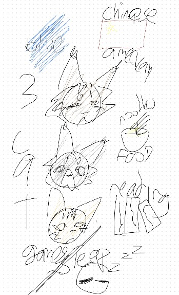

<br>
<h2 style ="color:cornflowerblue;"> SOPHIA'S BLOG <i>!</i></h2>
<h3> about me: </h3>
<div class="abtme">
i'm soph!! she/her ,  a minor, and chinese-american
<br>
check out my github page: <a href  ="https://github.com/55ophia"> here </a> !!!!
<br>
<div class="cat">
 ᓚᘏᗢ
</div>
</div>

<hr>
<h3> table of contents!!: </h3>
<div id="toc_container">
<ul class="toc_list">
  <li><a href="First">task list</a></li>
    <li><a href="Second">images</a></li>
    <li><a href="Third">timeline</a></li>
    <li><a href="forth"> reminders</a></li>
</ul>
</div>
<hr>
<h3 slot='h-1'> task list / hacks 4 this blog: </h3>

- [x] add link to blog
<br>
- [x] add image to blog (WHY ISNT IT WORKING nvm ty to my dad)
<br>
- [x] learn whts goin on with markdown (ish)
<br>
- [x] help aanya with her blog! (my partner)
<br>
- [x] do a blog theme
<br>
- [ ] for some reason changing this to html deletes the whole list so i cant make the font bigger...
<br>
- [ ] pass the interview. aanya is HOPEFULLY finished
<br>
- [ ] check over the blog w/ friends
<br>
- [x] fix the img like why is so... not aligned
<br>
- [x] go overboard on the html
<br>
- [ ] anything not created by me should go into gitignore, not commit
<br>
- [ ] make a reminder section
<br>
- [ ] make table of contents bro its not workin cyz it makes everytin html SOBSSS
<hr style="border: 6px dotted cornflowerblue">

<h3 slot="h-2">images, and such:</h3>

<div class="try">
    <div class="img">
    
    </div>
        <div class="tex">
        <br>
        <br>
        <article> 8/17 soo initally when i did this my partner was absent so i didn't have anybody to share it to,,, luckily she came back the next day !! i'm so glad i made a friend because i had NO CLUE what  to do. tysm aanya 
        <br>
        <br>
        <br>
        </article>
        </div>
</div>

<hr style="border: 6px dotted steelblue">
<h3 slot="h-3"> blog making timeline! </h3>

<table>
    <tr>
        <th> 8/22 </th>
        <th> 8/23 </th>
        <th> 8/24 </th>
    </tr>
    <tr>
    <td> opened up blog,,, FINALLY got the tools and the blog to open up after alotta trouble. only got it to work at the end of class tho, so that's all i did. at home i picked my theme and my dad helped me with sm</td>
    <td> this was when i REALLY started workin. i did started inputing links and text and colorful stuff and my task list. my dad helped me with the img cuz that thing was TORTUROUS. turns out it was in the wrong directory lol</td>
    <td> made the "what i did with my blog" thing on this day cuz mortensen told us too. i aint remembering this stuf all this sob, im trying to make the table have rounded corners but its not workin helpin out my friend rnn. i wanna make a table of contents</td>
    </tr>
</table>

<table>
    <tr>
        <th> 8/25 </th>
        <th> 8/28 </th>
    </tr>
    <td> today i did my live review and TURNSO UT I OT 90% CUZ I DIDNT PUSh. so iltereally went home and asked my comp sci dad and even he didn know. so i searched it up turns out i needed to make it public thru settings like wthhhh anyways </td>
    <td> so literally im tryna find out what the lab notebook check whtever but i have no clue what sgoin on like what is a ipynb whtever the frick thing an he isn't even clarifyin like what am i supposed to do?? like how do i code idek like where do i test the coding anyway</td>


</table>


<hr style ="border 6px dotted cadetblue">
<h3> reminders </h3>
put down edited dates in todays blog day
<br>
ask mortensen howto make table ofcontents
<br>
pwd shows where u r
<br>
ls shows list of all files
<br>
cd = change directoy
cd desktop= got to desktop folder
<br>
code . = opening the current directoy
<br>
mkdir = make directory
<br>
git init shows does somthin,, git shows something. github shares with interneT
<br>

<br>

```
is this a cold cenll
print("hello world")
th{background-color: lightblue;
text-align: center;}

WHY IS IT NIT WORKING
```


<style>
h2{background-color: powderblue;
font-size: 40px;
text-align: center;
font-family: "Shrikhand";}
.abtme{font-size: 25px}
hr{border: 6px dotted cornflowerblue;}
hr{background-color: white}
h3{font-size: 30px;
font-family:"Poppins";}
.cat{text-align: center}
.img{float: left;
padding: 40px;}
article{font-size: 25px}
table, th, td {border: 5px solid cadetblue;}
th{background-color: lightblue;
text-align: center;}

</style>